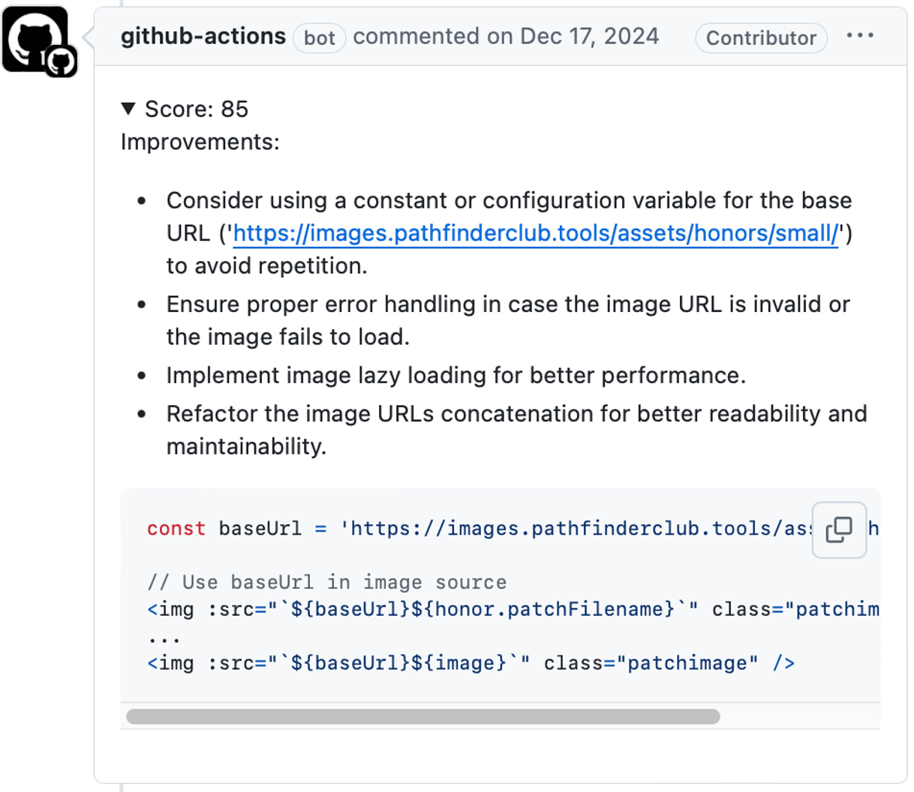
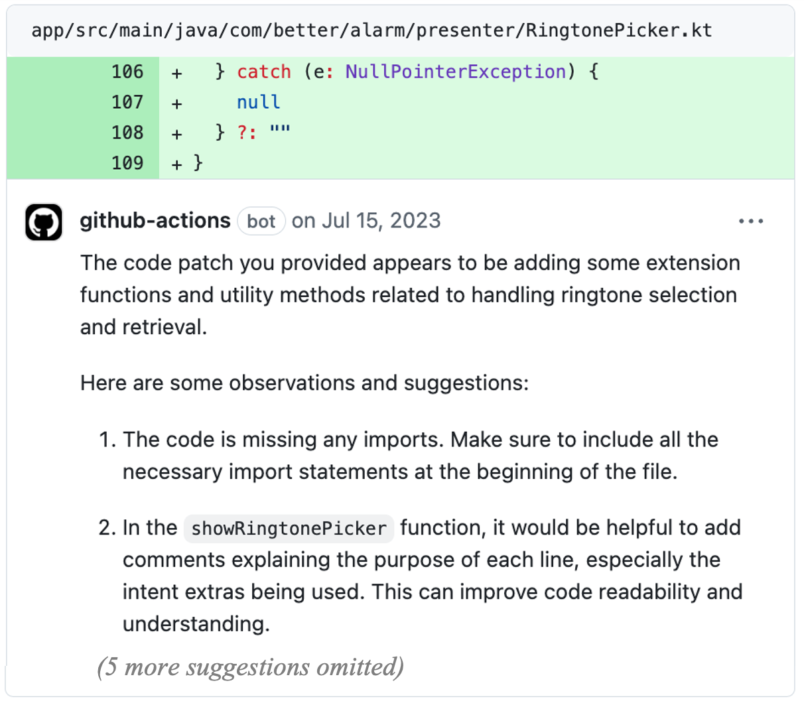
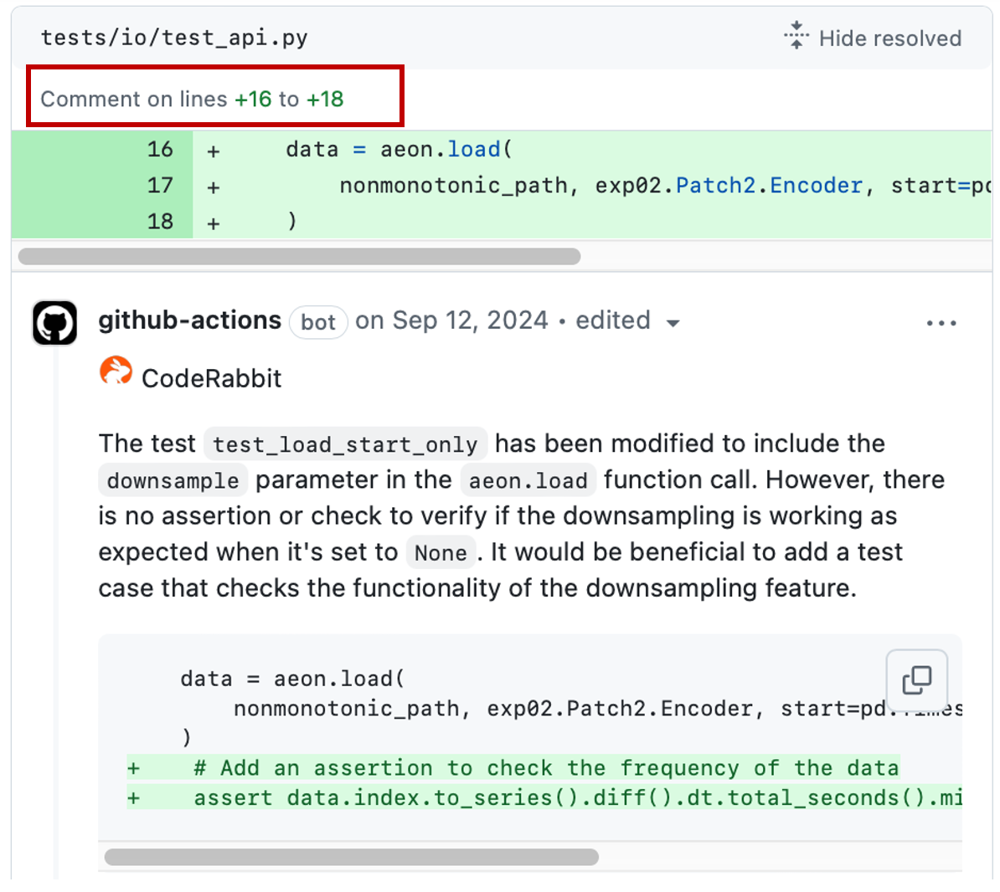

# AI Reviewer Analysis (Online Appendix)

This repository serves as the **online appendix** for our paper. It contains statistical data, scripts, and prompt templates used in our analysis of AI-powered code review actions.

Below are example comments from **PR-level**, **File-level**, and **Hunk-level review actions**, as used in our study.  
These examples are drawn respectively from:
- [Integral-Healthcare/robin-ai-reviewer](https://github.com/Integral-Healthcare/robin-ai-reviewer) (PR-level)
- [anc95/ChatGPT-CodeReview](https://github.com/anc95/ChatGPT-CodeReview) (File-level)
- [coderabbitai/ai-pr-reviewer](https://github.com/coderabbitai/ai-pr-reviewer) (Hunk-level)
and correspond to **Figure 1** in the paper.

#### 📝 PR-level Review Action  <sub>🔗 [GitHub PR general comment](https://github.com/PathfinderHonorManager/PathfinderHonorManagerUI/pull/673#issuecomment-2546855652) </sub>
<a href="https://github.com/PathfinderHonorManager/PathfinderHonorManagerUI/pull/673#issuecomment-2546855652">
  
</a>


#### 📄 File-level Review Action <sub>🔗 <a href="https://github.com/yuriykulikov/AlarmClock/pull/587#discussion_r1264388529">GitHub PR inline comment</a></sub>  
<a href="https://github.com/yuriykulikov/AlarmClock/pull/587#discussion_r1264388529">
  
</a>


#### 🔍 Hunk-level Review Action <sub>🔗 <a href="https://github.com/SainsburyWellcomeCentre/aeon_mecha/pull/407#discussion_r1755686425">GitHub PR inline comment</a></sub>  
<a href="https://github.com/SainsburyWellcomeCentre/aeon_mecha/pull/407#discussion_r1755686425">
  
</a> 


## 📁 Directory Overview
```
AIReviewActionAnalysis/
├── _data/  # Contains raw data for the 16 AI-based code review actions, including comments and related metadata
├── address_feature_matrix/  # Includes data and scripts used in RQ3 to analyze which factors influence whether code review comments lead to code changes
├── analyze_config_file/  # Module for analyzing configuration files
├── call_llm/  # Module for invoking various large language models (e.g., GPT, Claude)
├── llm_analysis/ # Code for LLM-assisted framework for assessing whether code review comments are actionable (Stage 1), and whether they have been addressed (Stage 2)
│ ├── extract_suggestion_prompter_3.py # Prompt template used in Stage 1 analysis
│ └── analyze_addressed_prompter_4.py # Prompt template used in Stage 2 analysis
├── statistics/ # All quantitative results and data tables presented in the paper
├── yaml_parse/  # Module for parsing configuration files 
├── config.py  # Main configuration file for the project; if you plan to run the code, you need to set your absolute project path here
```


## 🔍 Mapping to Research Questions (RQ1–RQ3)

This repository supports the analyses of the three core research questions from our paper:

---

### 🧩 RQ1: *How are LLM-driven code review actions adopted in GitHub repositories?*

To explore the adoption and configuration of AI-based review actions, we provide:

- `statistics/Setup_Data.xlsx`: Contains detailed metadata for all 16 AI-based code review actions analyzed in the study. It includes a full version of **Table I** (design choice comparison), as well as a matrix comparing supported configuration parameters across the tools.
- `statistics/Data_Collection.xlsx`: Documents our multi-stage data collection pipeline and the distribution of data across repositories, PRs, and comments at each stage.
- `statistics/analysis_config.xlsx`: Analyzes configuration evolution across 178 mature repositories.
- `_data/`: Stores the raw data corresponding to each of the 16 AI-based review actions, including extracted comments and metadata.

---

### 🧪 RQ2: *How accurately can we automatically detect whether code review comments have been addressed?*

To evaluate the effectiveness of AI-generated comments and validate our two-stage addressing analysis framework, we include:

- `statistics/RQ2/human_annotation/`: Contains our **Annotation Guidelines** and results of manual annotation on a sampled dataset.
- `statistics/RQ2/LLM_performance.xlsx`: Summarizes evaluation results across multiple LLMs of our framework.
- `statistics/RQ2/First_eval_details.xlsx`, `Second_eval_details.xlsx`:  Provide **detailed run-wise performance** (5 repeated runs) for each evaluated LLM or LLM combination in the first and second evaluation rounds. 
- `llm_analysis/`: Includes the core scripts and prompt templates used in our two-stage addressing analysis framework:
  - `extract_suggestion_prompter_3.py` (Stage 1)
  - `analyze_addressed_prompter_4.py` (Stage 2)

---

### 🎯 RQ3: *Which factors impact the likelihood that code review comments lead to code changes?*

To investigate the factors influencing whether a comment leads to a change, we provide:

- `statistics/RQ3.xlsx`: Provides the complete 45-feature list (as shown in **Table IX**), and the full SHAP-based interpretation of model results (**Table X**).
- `address_feature_matrix/`: Contains the data and scripts used to construct structured features, train the Random Forest classifier, and perform SHAP interpretation.
