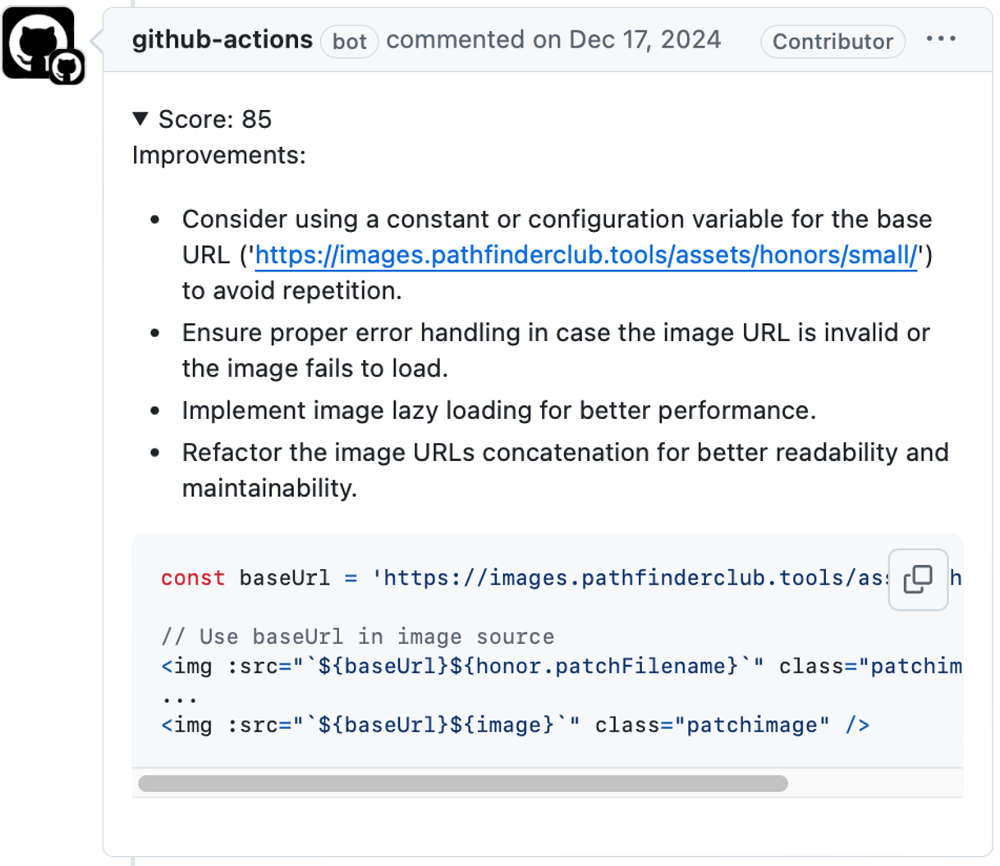
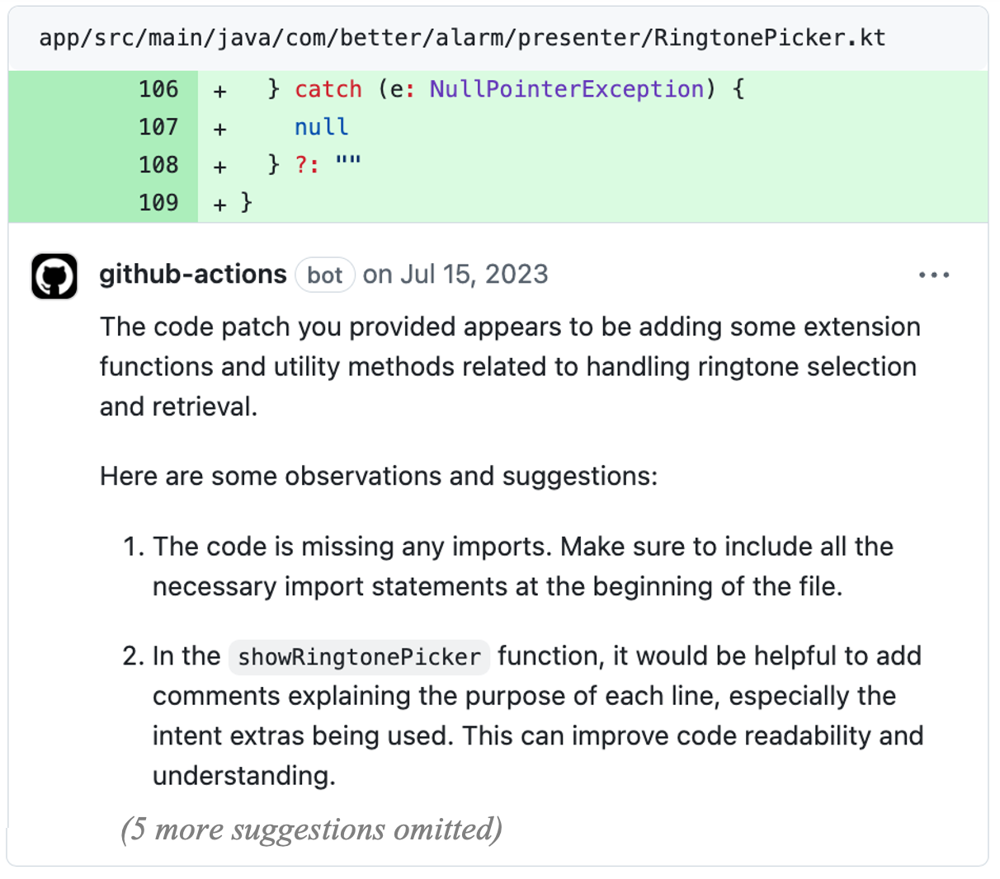
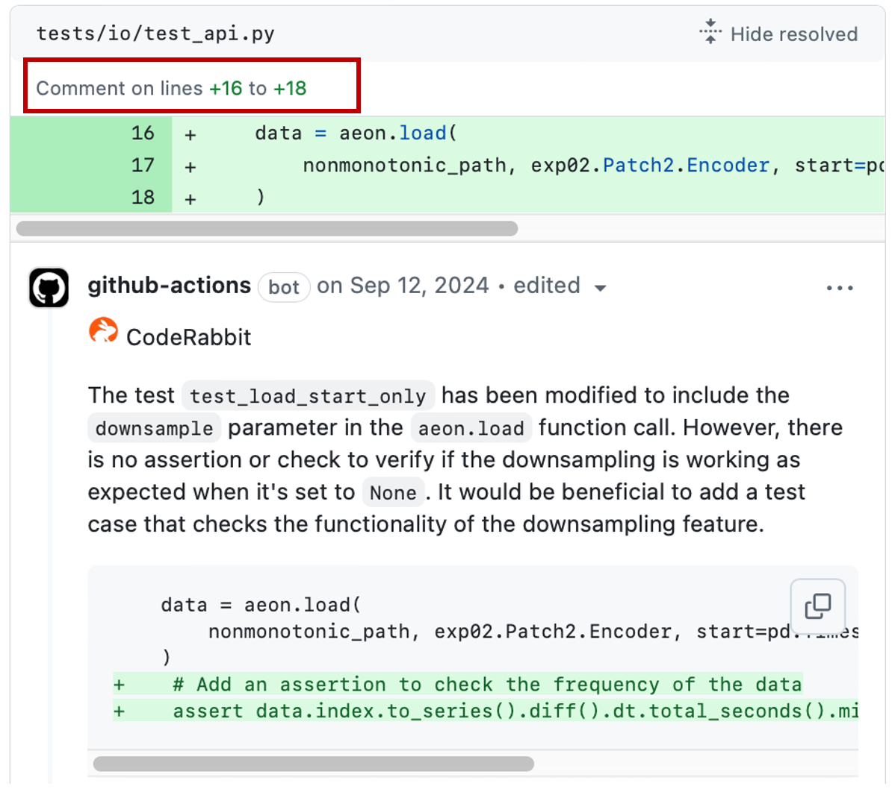

# AI Reviewer Analysis (Online Appendix)

This repository serves as the **online appendix** for our paper. It contains statistical data, scripts, and prompt templates used in our analysis of AI-powered code review actions.

Below are example comments from **PR-level**, **File-level**, and **Hunk-level review actions**, as used in our study.  
These examples are drawn respectively from:
- [Integral-Healthcare/robin-ai-reviewer](https://github.com/Integral-Healthcare/robin-ai-reviewer) (PR-level)
- [anc95/ChatGPT-CodeReview](https://github.com/anc95/ChatGPT-CodeReview) (File-level)
- [coderabbitai/ai-pr-reviewer](https://github.com/coderabbitai/ai-pr-reviewer) (Hunk-level)
and correspond to **Figure 1** in the paper.

#### 📝 PR-level Review Action  <sub>🔗 [GitHub PR general comment](https://github.com/PathfinderHonorManager/PathfinderHonorManagerUI/pull/673#issuecomment-2546855652) </sub>
<a href="https://github.com/PathfinderHonorManager/PathfinderHonorManagerUI/pull/673#issuecomment-2546855652">
  
</a>


#### 📄 File-level Review Action <sub>🔗 <a href="https://github.com/yuriykulikov/AlarmClock/pull/587#discussion_r1264388529">GitHub PR inline comment</a></sub>  
<a href="https://github.com/yuriykulikov/AlarmClock/pull/587#discussion_r1264388529">
  
</a>


#### 🔍 Hunk-level Review Action <sub>🔗 <a href="https://github.com/SainsburyWellcomeCentre/aeon_mecha/pull/407#discussion_r1755686425">GitHub PR inline comment</a></sub>  
<a href="https://github.com/SainsburyWellcomeCentre/aeon_mecha/pull/407#discussion_r1755686425">
  
</a> 


## 📁 Directory Overview
```
AIReviewActionAnalysis/
├── statistics/ # All quantitative results and data tables presented in the paper
├── llm_analysis/ # Code for invoking large language models (LLMs) for automated analysis
│ ├── extract_suggestion_prompter_3.py # Prompt template used in Stage 1 analysis
│ └── analyze_addressed_prompter_4.py # Prompt template used in Stage 2 analysis
```


> 📌 **Note:** **More detailed documentation will be provided in upcoming updates.**
